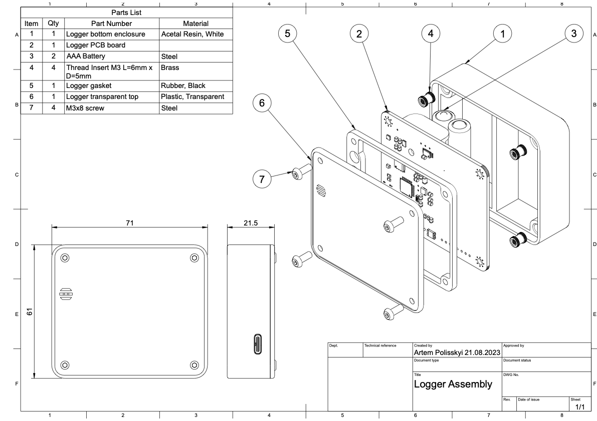

# Enclosure drawings

## Renders

## Common assembly 2D drawings

## Common assembly animation

https://github.com/polesskiy-dev/iot-risk-data-logger-nfc-samd21/assets/5185707/992220a2-24c9-4537-aab9-c0bec074c23c

## Enclosure parts

### Transparent top

### Seal TPU gasket

### Main bottom body

## Some creation process pictures

### PCB Model

### Assembled

### Assembly

### Manufacturing order

